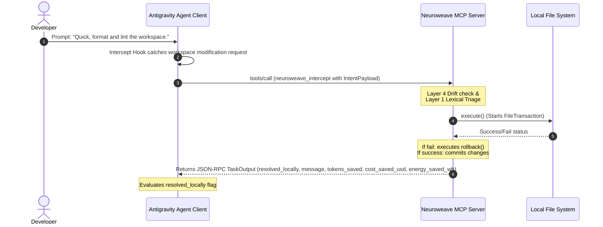

# Neuroweave Operational Flow

This document specifies the operational cadence, trigger conditions, and lifecycle sequence of the Neuroweave intercept pipeline.

---

## ⚡ Trigger Condition

**Neuroweave is NOT a general-purpose assistant and is NEVER invoked for conversational queries, conceptual questions, or search actions.**

It operates strictly as a local intercept gate. It is triggered **only** via the `basal_ganglia_bypass.md` pre-turn hook when:
*   A developer prompt explicitly requests a modification, formatting, scaffolding, or cleaning of files within the project workspace.
*   Repetitive, non-subjective directives are detected.

---

## 🔄 The Intercept Sequence

When the trigger condition is met, the Agent-to-Server lifecycle executes the following chronological sequence:

1.  **Developer Prompts**: The developer issues a workspace instruction.
2.  **Agent detects workspace modification**: The global agent intercept pre-turn hook catches that the prompt involves filesystem mutation.
3.  **Agent pings Neuroweave**: The agent halts its standard planning/reasoning sequence, packages the query details into a standardized `IntentPayload` (containing `session_id`, `intent_hash`, and `raw_prompt`), and pings the local `neuroweave_basal_ganglia` daemon via `tools/call: neuroweave_intercept`.
4.  **Neuroweave routes and evaluates**: 
    *   Neuroweave evaluates the prompt against the Layer 4 Semantic Drift filter (trapping subjective language).
    *   If safe, it routes the intent to the corresponding compile-time subroutine and executes the transactional file I/O.
5.  **Agent reads `resolved_locally` flag**: The agent intercepts the returned `TaskOutput` payload from Neuroweave and processes the resolution branches.

---

## 🚦 Resolution Branches

Upon reading the `TaskOutput`, the Agent Client must execute one of the two following branches:

### 🟢 Branch A: Cache Hit (`resolved_locally == true`)
*   **Action**: The local subroutine successfully resolved the developer's intent and mutated the workspace files with transactional safety.
*   **Cadence**: 
    1. The Agent Client dumps the `raw_prompt` and `task_output` to a local `last_action_payload.json` file in the project root.
    2. The Agent Client invokes `python telemetry_tracker.py` to record the cost and energy savings in the persistent `savings_log.json` database.
    3. The Agent Client immediately outputs the returned `message` success trace and savings statistics to the UI and **abruptly terminates the active cognitive turn**.
*   **Result**: Bypasses the upstream LLM completely. **API Cost: $0.00. Latency: <5ms. Savings: 1500 tokens / 0.01 Wh / $0.0001125 USD.**

### 🔴 Branch B: Cache Miss (`resolved_locally == false`)
*   **Action**: The intent involved subjective language, triggered semantic drift (e.g. *"modernize"* or *"optimize"*), or was out-of-registry bounds.
*   **Cadence**: The Agent reads the `escalation_reason` and seamlessly escalates the prompt to the designated upstream LLM (defaulting to the highly economical `gemini-3.1-flash-lite`) for standard cognitive execution and reasoning.
*   **Result**: Ensures complex, novel, or subjective tasks are still safely handled by the cognitive capabilities of the AI.
