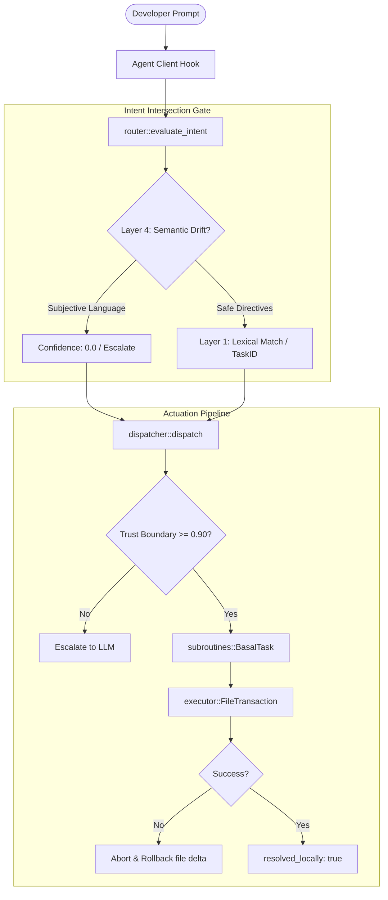

# Neuroweave: The Basal Ganglia Engine (v1.0-stable)

Neuroweave is a high-performance, asynchronous **Deterministic Local Bypass Engine** compiled in Rust. It functions as a native Model Context Protocol (MCP) server daemon to intercept development intents, offloading repetitive, non-subjective workspace tasks directly to zero-cost, transactional local subroutines.

## 🧠 The Problem It Solves

Stochastic Large Language Models (LLMs) are highly capable but computationally expensive, slow, and prone to **"Semantic Drift"** when evaluating subjective directives.
1.  **Token Waste**: Asking an LLM to repeatedly perform deterministic tasks (such as code formatting, import sorting, or API scaffolding) drains token quotas unnecessarily.
2.  **Turnaround Latency**: Outbound network requests to upstream LLMs routinely incur multi-second latencies for operations that can run locally in less than 5 milliseconds.
3.  **Intent Ambiguity Drift**: Stochastic models risk over-interpreting or corrupting code when processing subjective prompts like *"improve the code"* or *"modernize the layout"*.

Neuroweave acts as the primary firewall, triaging prompts locally. If an intent is clean and recognized, it executes it with zero API cost and near-instant latency. If the prompt contains subjective language or unknown blast radiuses, it escalates seamlessly to the LLM.

---

## 🛠️ Architecture & Core Components

Neuroweave is engineered around the **Single-Binary Appliance Pattern**, boasting an idle memory footprint of `< 30MB` and cold-boot times under `50ms`.



### 1. The Intent Intersection Gate (`src/router.rs`)
The triage center. It executes compiled `OnceLock` regex filters. It strictly processes **Layer 4 Semantic Drift** (e.g. checking for danger words like *"modernize"*, *"simplify"*, *"improve"*) first. If drift is detected, it zeroes the confidence and flags it. Otherwise, it proceeds to **Layer 1 Lexical matching** (e.g. mapping `"format"` and `"lint"` to safe task IDs).

### 2. The Confidence Engine & Trust Radius (`src/confidence.rs` & `src/core.rs`)
Defines the `ConfidenceProfile` and `TrustRadius` of tasks. Every local task declares its blast radius parameters—defining constraints on maximum mutable files, permitted AST mutations, cross-module writes, and mandatory rollbacks.

### 3. The Transactional Actuator (`src/executor.rs` & `src/subroutines.rs`)
Guarantees absolute workspace safety. File edits are managed in a transactional context via `FileTransaction`. In the event of an OS-level friction error (such as folder permissions or lock limits), it immediately executes a `rollback()` to the pre-transaction state and escalates the execution back to the LLM with the error trace attached.

### 4. The Dispatcher (`src/dispatcher.rs`)
Enforces strict security trust boundaries. Any interaction falling below `0.90` confidence or yielding active ambiguity flags is blocked from local physical file I/O and routed back safely to standard LLM execution.

---

## 🚀 Execution & Usage

Neuroweave is configured to compile as a standalone static executable with zero external runtimes.

### Build release binary:
```bash
cargo build --release
```

### Run E2E verification test harness:
```bash
target/release/neuroweave.exe
```

### Activate stdio JSON-RPC MCP daemon mode:
```bash
target/release/neuroweave.exe --mcp
```
